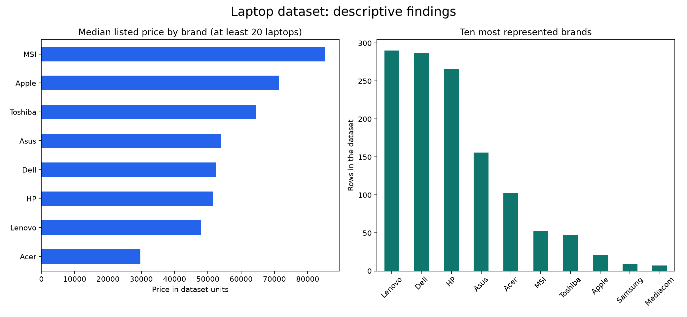

# Laptop Price Analysis with SQL

SQL data-cleaning and exploratory-analysis exercises on a dataset of 1,300+
laptops. The project examines specifications and price, and prepares features
such as screen pixel density and price categories.

## Repository guide

| File | Purpose |
| --- | --- |
| `laptopData.csv` | Source laptop dataset |
| `laptop-sql-data-cleaning.sql` | Backups, null handling, type conversion and specification cleanup |
| `LaptopEDA.sql` | Univariate, bivariate and feature-engineering analysis |

## Analysis workflow

1. Import `laptopData.csv` into a disposable local database as `laptopdata`.
2. Review schema references: the cleaning script uses `sql_cx_live` in some queries.
3. Run the cleaning statements in `laptop-sql-data-cleaning.sql` in order.
4. Work through `LaptopEDA.sql` to inspect distributions and relationships.

The scripts include `ALTER`, `UPDATE` and `DELETE` statements. Use a copy of the
dataset and retain the backup table created by the cleaning script.


## SQL compatibility

The cleaning work uses MySQL-style syntax. The EDA file also contains
`PERCENTILE_CONT ... WITHIN GROUP`, which is not supported as written in MySQL.
Adapt those percentile exercises to your database engine. These are exploratory
SQL exercises rather than a single portable migration script.

## Skills demonstrated

Data inspection, data cleaning, type conversion, grouping, window-function
exploration and feature engineering. Numerical findings should be reproduced
from the queries; no unverified performance or business-impact claims are made.

## Reproducible dataset findings



```bash
python -m pip install -r requirements.txt
python analyze.py
```

The committed CSV contains **1,303 rows**, **19 companies**, **30 rows with missing
price** and **58 duplicate-content rows** after ignoring the source index column.
The median of available prices is **52,161.12 in the dataset's original units**.
Currency is not verified by this repository's metadata.

Missing prices and duplicates are counted, not silently removed. Brand summaries
use rows with a valid price and company. The chart compares median prices only
for brands represented by at least 20 valid rows.

Inspect the [summary JSON](docs/results/summary.json) and
[brand summary CSV](docs/results/brand_summary.csv). The Python analysis validates
the committed CSV independently; it does not claim that the mixed-dialect SQL
scripts have been executed successfully in MySQL.
